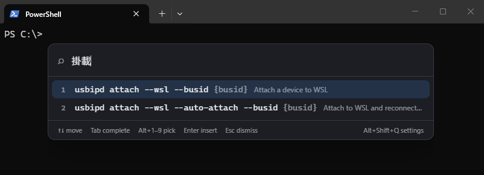

<div align="center">


# QQKey

**Find the command. Have it typed for you. Press Enter yourself.**

A keyboard launcher for Windows that *inserts* commands into your prompt instead of running them.


**English** · [繁體中文](README.zh-Hant.md)

</div>

---

> Yes, this is a reinvented wheel. I took the existing ones for a spin and simply did not care for
> the tread pattern — so I had one made to my taste. Although "made" is generous: Opus cut the tread,
> I stood nearby being hard to please.

`usbipd`, `git`, `netsh`, `docker` — dozens of subcommands and flags that never quite stick, so
every time means another trip through `--help`. QQKey lets you search those commands by keywords
in your own language and puts the result in your command line, with the caret parked exactly where
you have to take over.

It never presses Enter for you. That is the whole point: you still read the command before it runs.

<p align="center">
  
</p>

The interface above is in English and the query is `掛載`. Search keywords are the union of
all seven languages, so switching the interface never shrinks what you can find.

Press Enter on that first entry and the text lands in the prompt, cut off before the placeholder:

```
PS C:\> usbipd attach --wsl --busid ▮
```

Nothing has run. The caret is where you take over, and whether to press Enter is up to you.

## 😭 Why "QQ"

`Q_Q` is a crying face — and in Taiwanese internet slang, writing just **QQ** means exactly that.

It is the face you make when the flag you need falls out of your head. You are three commands into
something, you know the tool, you know roughly what the option is called, and it is simply gone. So
you open another tab, run `--help`, scroll, find it, come back — and by then you have lost the thread
of what you were actually doing.

That moment is the whole reason this exists. `Alt+Q` is meant to be shorter than the trip to `--help`.

## Highlights

- **Insert, never execute.** The command stops just before the first `{placeholder}`, and control
  characters are stripped on the way out — a stray `\r\n` reaching a terminal *is* an Enter press,
  so that filter is the last line of defence.
- **Appears at the caret.** The launcher pins itself to the text cursor of the window you were
  typing in, not to the middle of the screen. Three layers of fallback, then screen-edge clamping.
- **Works in any window.** Focus is remembered before the launcher shows, restored afterwards, and
  the text is delivered with `SendInput`. Terminals, editors, browser address bars, dialog boxes.
- **Frecency ordering.** Fuzzy match score × usage weight, with a 30-day half-life. The commands
  you actually use float to the top; the number you see (`★7`) is the same one the sort uses.
- **Learns from your history.** Commands are imported incrementally from your PSReadLine history —
  filtered first, so lines that look like they carry credentials never reach the database.
- **104 built-in commands** for usbipd, git, wsl, netsh, docker, winget, npm and cargo, each with a
  description and search keywords in all seven UI languages.
- **Seven-language UI** — 繁體中文, 简体中文, 日本語, English, Français, Deutsch, 한국어 —
  switched live, no restart. Search keywords are the *union* of all seven, so setting the UI to
  English does not cost you the ability to find `usbipd attach --wsl` by typing 掛載.
- **Local only.** One SQLite file in `%APPDATA%`. Nothing is sent anywhere, and there is no
  network code to audit.

## Install

Windows 10 or 11, x64. Grab an installer from the
[Releases page](https://github.com/theanswertw/QQKey/releases) — either
`QQKey_x.y.z_x64_en-US.msi` or `QQKey_x.y.z_x64-setup.exe`.

The installers are **not code-signed**, so SmartScreen will show *"Windows protected your PC"* and
hide the install button behind **More info → Run anyway**. That is what Windows does with any
unsigned binary from a publisher it has not seen before, not a sign that the file is wrong — every
release lists SHA-256 hashes if you want to check the download against what was published, and
[building from source](#development) produces the same two installers.

QQKey then lives in the tray with no visible window. Left-click the icon to open the launcher,
right-click for the menu (launcher / settings / quit). *Start automatically at sign-in* is a
checkbox in the settings window, off by default.

## Keys

| Key | Action |
|---|---|
| `Alt+Q` | Open / dismiss the launcher (rebindable) |
| `Alt+Shift+Q` | Open the settings window |
| `↑` `↓` | Move the selection |
| `Tab` | Complete the selection into the search box — completes only, does not insert |
| `Alt+1`–`Alt+9` | Pick that entry directly |
| `Enter` | Insert into the command line |
| `Esc` | Dismiss, and hand focus back to where you were |

<details>
<summary>Why these keys, specifically</summary>

**`Alt+Q`, not `Alt+Space`.** Windows reserves `Alt+Space` for the window menu; inside Windows
Terminal it takes an extra settings change before the app ever sees it.

**Direct pick on `Alt`, not on bare digits.** Command names carry digits of their own — `7z`,
`base64`, `md5sum`, `python3`. The number row has to stay available for the query.

**Settings on a global shortcut, not a key inside the launcher.** A Chinese IME swallows
combinations like `Ctrl+,`, eating the modifier and leaving a full-width comma behind.

**Enter and `↑↓` are handed to the IME while composing.** Typing 掛載 in Bopomofo means pressing
Enter to confirm the candidate — and confirming a character should not fire off a command.

</details>

## Settings

`Alt+Shift+Q`, or the tray menu. Three tabs:

**Commands** — search, filter by source, add / edit / delete, enable / disable in bulk, reset the
usage statistics of a single entry. Editing a built-in entry turns it into your own, so later
catalogue updates leave your version alone.

**General** — UI language · start at sign-in · rebind the shortcut · history learning and a manual
import · the credential-filter pattern · launcher background opacity · share commands as JSON
through the clipboard · full backup and restore · open the log folder.

**About** — version, licence, author, contact.

> **Sharing and backup are different things.** Sharing carries only the commands you added or
> edited yourself: the built-in catalogue is already on the other machine, and anything learnt from
> history may carry work content. A backup carries *everything* — all entries, the accumulated
> usage statistics and every setting — because those thousands of learnt entries travel no other
> way. Restoring **replaces** what is there now.

## Privacy and security

QQKey is a keyboard automation tool by nature, and it reads your shell history. Both deserve to be
stated plainly.

- **It synthesises keystrokes.** Text is delivered through `SendInput`, and caret location uses UI
  Automation. That is the same surface automation tooling uses, so an EDR product may take an
  interest. Read the code before you deploy it, and check it against your organisation's policy.
- **History lines that look like secrets are dropped whole.** Anything matching `password`,
  `token`, `secret`, `credential`, `ConvertTo-SecureString` and friends — or holding a run of 20+
  characters after `=` or `:` — is skipped entirely. It never reaches the database and never shows
  up in the launcher. Only the *number* of skipped lines is reported; their contents are not
  recorded anywhere. The filter deliberately over-blocks: a command caught by mistake can be added
  back by hand, while a credential that slips through stays in the database.
- **Everything stays on the machine.** `%APPDATA%\com.jeremywen.qqkey\qqkey.db`. History learning
  can be switched off entirely.
- **The log records neither window titles nor inserted text.** It lives in
  `%LOCALAPPDATA%\com.jeremywen.qqkey\logs\` — note: Local, not Roaming — and tracks how far each
  step got, because a tray-only app has nowhere else to explain itself. Foreground tracking fires
  on every window switch, so logging titles there would amount to writing down everything you
  opened all day. It stores the window handle and nothing else.

## How it works

Getting a keypress to end up as text in someone else's window is a strictly ordered sequence of
Win32 calls:

1. **`inject.rs`** installs a `SetWinEventHook` at startup and tracks the foreground window
   *continuously*. Querying `GetForegroundWindow` at the moment the hotkey fires is too late —
   QQKey's own hidden window can still be holding the foreground right after launch.
2. **`hotkey.rs`** remembers that window, positions the launcher, *then* shows it. The first two
   have to happen before `show()`: once the launcher is visible it *is* the foreground window, and
   the target's caret is no longer reachable.
3. **`caret.rs`** locates the caret through three layers — `GetGUIThreadInfo`, then UI Automation
   `TextPattern`, then the bottom-left corner of the window — and clamps the result to the screen,
   flipping above the caret when there is no room below.
4. On accept, **`template.rs`** truncates at the first placeholder and strips control characters,
   **`inject.rs`** restores focus (`SetForegroundWindow`, falling back to `AttachThreadInput` when
   the foreground lock refuses), **polls until the target really is the foreground window**, and
   only then sends the string as UTF-16 through `SendInput`. If it never gets there, the insert
   fails loudly rather than typing into an unverified window.
5. Usage is recorded **only if the insert succeeded** — a failed attempt should not promote
   anything. On failure the launcher comes back with the reason written inside it, because a
   launcher that closes without typing anything just reads as a broken tool.

```
src/
├─ launcher/     the candidate box
├─ settings/     the settings window
├─ i18n/         locale resolution + seven locale files
└─ shared/       types shared with the backend
src-tauri/
├─ resources/catalog/*.json    built-in catalogue, embedded at compile time
└─ src/
   ├─ hotkey.rs     global shortcut, show / hide
   ├─ caret.rs      caret location (three fallbacks) + screen clamping
   ├─ inject.rs     foreground tracking, focus restore, SendInput
   ├─ template.rs   {placeholder} truncation and sanitising
   ├─ catalog/      candidate types, built-in catalogue, history learning
   ├─ store.rs      SQLite, schema migrations, frecency persistence
   ├─ ranking.rs    fuzzy match × frecency
   ├─ state.rs      database handle + in-memory candidate pool
   ├─ i18n.rs       system locale detection, backend user-facing strings
   └─ commands.rs   IPC surface
spike/
├─ caret-probe/     caret location experiments (and their findings)
└─ input-probe/     SendInput and hotkey verification
```

The candidate pool lives in memory (`RwLock<Vec<Entry>>`), so a keystroke's worth of searching
never touches the database.

## Development

Requires Rust (the toolchain is pinned to 1.92 in `rust-toolchain.toml`), Node.js, and the
[Tauri v2 Windows prerequisites](https://v2.tauri.app/start/prerequisites/).

```powershell
npm install
npm run tauri dev      # dev mode, hot reload, vite on :1420
npm run tauri build    # MSI + NSIS installers under src-tauri/target/release/bundle/
npm run build          # frontend only — also the only TypeScript type check (tsc && vite build)
```

```powershell
cd src-tauri
cargo test                     # 86 backend unit tests
cargo test flips_above         # one test — names are descriptive sentences, usable as filters
cargo test --lib caret::       # one module
```

> When restarting QQKey, the previous process has to exit fully before the global shortcut is
> released. Start the new one too quickly and registration fails — and release builds have no
> console to tell you so.

There is no frontend test suite; type checking is `npm run build`, and the type annotation in
`src/i18n/resources.ts` is the only thing keeping the seven locale files in step.

## Contributing

Issues and pull requests are welcome. The most useful contribution is usually a **command worth
adding to the built-in catalogue** — especially for a tool whose flags you have had to look up more
than twice.

Adding one:

1. Add the entry to the right file under `src-tauri/resources/catalog/`, or add a new file *and*
   register it in the `CATALOGS` list in `catalog/builtin.rs` — the catalogue is embedded into the
   executable, not read at runtime.
2. `description` and `keywords` are maps over all seven languages (`zh-Hant` `zh-Hans` `ja` `en`
   `fr` `de` `ko`). `template` is written once: it is the database's UNIQUE key, and duplicating it
   seven times fails silently.
3. `cargo test` — the catalogue tests reject duplicate templates, unparsable files and any missing
   translation.

Keywords in your own language are what make the search work, so a translation you would actually
type beats a literal one.

`CLAUDE.md` in the repository root is the architecture guide: the invariants, why things are
ordered the way they are, and what was deliberately *not* done. Worth reading before a larger
change. It is written in Traditional Chinese.

Code conventions: comments, docs and UI copy are in Traditional Chinese; test names are descriptive
English sentences. New user-facing strings go in `src/i18n/locales/*.json` (frontend) or the
`messages!` macro in `i18n.rs` (backend) — all seven languages at once, in both cases.

## Known limitations

- **The launcher enters IME composition mode when a Chinese IME is active.** Shared behaviour among
  Windows applications; switching input mode is manual for now. Disabling the IME outright is not
  an option — searching by Chinese keywords is a feature.
- **Entries you have edited stay in the language you edited them in.** Deliberate: overwriting them
  on a language switch would break the "edited entries are never overwritten" invariant, which
  amounts to silently destroying the description you wrote. Delete the entry to get the built-in
  version back on the next sync.
- **The startup-failure dialog follows the Windows display language**, not the one picked in
  settings. At that point the database is not open yet, so there is nothing to read the setting from.
- **`restore()` overwrites the shortcut and opacity settings without re-registering or pushing
  them.** They apply after a restart. Known gap, not yet fixed.
- **`rusqlite` is pinned to 0.37.** 0.40 pulls in `libsqlite3-sys` 0.38, whose build script uses
  the unstable `cfg_select` and does not compile on Rust 1.92 stable.
- The CSS font stack deliberately names no CJK font, leaving Chromium to do language-aware fallback
  from `<html lang>`. Verifying that properly needs a machine with the relevant language packs
  installed — a dev box without Japanese fonts will give you a false pass.

## Credits

**Claude Opus 5** — lead. Architecture, the Win32 call ordering, all seven languages, and this README.
**Jeremy Wen** — supporting. Product direction, everything a repository does not contain, and the veto.

The split settled naturally. Opus writes the code and remembers why the calls have to go in that
exact order. Jeremy supplies what no model can read off a codebase: that Windows reserves
`Alt+Space`, that a Chinese IME swallows `Ctrl+,` and leaves a full-width comma behind, that a
launcher which closes without typing anything just reads as broken. He also clicks the windows Opus
cannot click, and takes the screenshots Opus cannot take.

Best catch to date: while cleaning up after a screenshot, Opus had written a `Stop-Process` against
the Windows Terminal process. Every terminal window on that machine lives in that one process —
including the one the session itself was running in. Jeremy read the line before it ran.

Questions, commands worth adding to the built-in catalogue, and bug reports all reach
[Jeremy](mailto:jeremy@jeremywen.com); the inbox is still his. When reporting a problem, please
avoid pasting command text that contains credentials or internal paths.

## Licence

[GNU GPL v3.0](LICENSE) © 2026 Jeremy Wen — who holds the copyright, whatever the section above
implies.

Copyleft on purpose. Use it, read it, change it, run it at work — all fine. But if you distribute
something built on it, that thing ships under GPL-3.0 too, with its source. Nobody gets to close this
up and sell it.

Version 0.1.0 went out under MIT. That grant cannot be withdrawn and still covers those commits;
the change applies from here on.
