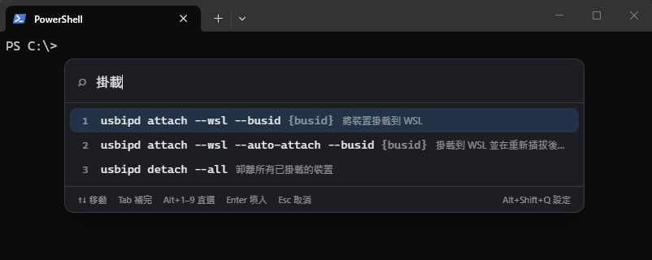

<div align="center">


# QQKey

**找到命令，讓它幫你打出來，Enter 你自己按。**

Windows 上的鍵盤啟動器——把命令**填入**你的命令列，而不是執行它。


[English](README.md) · **繁體中文**

</div>

---

> 是，這又是一顆重新造的輪子。市面上的輪子我都轉過幾圈，就是不喜歡那個胎紋——只好自己開一顆
> 合胃口的。當然「開」這個字有點抬舉我：胎紋是 Opus 刻的，我負責在旁邊嫌。

`usbipd`、`git`、`netsh`、`docker`——子命令與旗標一大堆，就是記不住，每次都得再翻一次
`--help`。QQKey 讓你用自己語言的關鍵字找到那些命令，然後把結果填進命令列，游標停在你
必須接手輸入的位置。

它從不幫你按 Enter。這正是重點：命令跑之前，你還是自己看過一遍。

<p align="center">
  
</p>

在提示字元前按下 `Alt+Q`，打「掛載」，候選框就貼在游標下方。`{busid}` 是灰字提示，
表示那裡要你自己填。

對第一筆按 Enter，文字落進提示字元，截在佔位符之前：

```
PS C:\> usbipd attach --wsl --busid ▮
```

什麼都還沒執行。游標就在你該接手的地方，要不要按 Enter 是你的事。

## 😭 為什麼叫 QQ

`Q_Q` 是哭哭臉，網路上單寫 **QQ** 就是這個意思。

那正是你忽然想不起某個旗標時的表情。事情做到一半，工具你熟、選項大概叫什麼你也知道，
就是想不起來——於是開另一個分頁跑 `--help`、往下捲、找到、切回來，而原本在做的那件事
已經斷了線。

QQKey 就是為那一刻做的。`Alt+Q` 該比跑一趟 `--help` 更快。

## 特色

- **填入，不執行。** 命令止於第一個 `{佔位符}` 之前，送出前再剝一次控制字元——`\r\n` 送到
  終端機就等同 Enter，所以那道過濾是最後一道防線。
- **貼齊輸入游標。** 候選框對齊的是你剛剛在打字的那個視窗的文字游標，不是螢幕正中央。
  三層 fallback，之後再做螢幕邊界夾制。
- **任何視窗都能用。** 顯示候選框前先記住焦點，之後還原，再用 `SendInput` 送出文字。
  終端機、編輯器、瀏覽器網址欄、對話框都可以。
- **frecency 排序。** 模糊比對分數 × 使用權重，三十天半衰期。你真的在用的命令會自己上浮；
  畫面上那個 `★7` 跟排序用的是同一個值。
- **從歷史學習。** 從 PSReadLine 歷史增量匯入你實際用過的命令——先過濾，疑似夾帶憑證的行
  不會進資料庫。
- **內建 104 筆命令**，涵蓋 usbipd、git、wsl、netsh、docker、winget、npm、cargo，
  七個介面語言的說明與搜尋關鍵字都齊備。
- **七語言介面**——繁體中文、简体中文、日本語、English、Français、Deutsch、한국어——
  即時切換，不必重新啟動。搜尋關鍵字是七個語言的**聯集**，所以介面設成英文，並不會讓你失去輸入
  「掛載」找到 `usbipd attach --wsl` 的能力。
- **只在本機。** `%APPDATA%` 下一個 SQLite 檔案。不對外傳送，也沒有網路程式碼需要審查。

## 安裝

Windows 10 或 11，x64。到
[Releases 頁面](https://github.com/theanswertw/QQKey/releases)取安裝檔——
`QQKey_x.y.z_x64_en-US.msi` 或 `QQKey_x.y.z_x64-setup.exe` 任一。

安裝檔**未經程式碼簽章**，所以 SmartScreen 會顯示「Windows 已保護您的電腦」，把安裝按鈕
藏在「其他資訊 → 仍要執行」後面。任何來自 Windows 沒見過的發行者的未簽章程式都是這樣，
不代表檔案有問題——每個 release 都附上 SHA-256，可以核對下載到的是不是發佈出來的那一份；
[自行建置](#開發)產出的也是同樣這兩個安裝檔。

安裝後 QQKey 常駐在系統匣，平常沒有可見視窗。左鍵單擊圖示叫出候選框，右鍵開選單
（叫出候選框／設定／結束）。開機自動啟動是設定畫面裡的一個選項，預設關閉。

## 快捷鍵

| 按鍵 | 動作 |
|---|---|
| `Alt+Q` | 叫出／收起候選框（可改綁） |
| `Alt+Shift+Q` | 開啟設定畫面 |
| `↑` `↓` | 移動選取 |
| `Tab` | 把選取項目補進搜尋框——只補完，不填入 |
| `Alt+1`–`Alt+9` | 直接選取對應項目 |
| `Enter` | 填入命令列 |
| `Esc` | 取消，並把焦點還給原本的視窗 |

<details>
<summary>為什麼是這幾顆鍵</summary>

**`Alt+Q` 而非 `Alt+Space`。** 後者是 Windows 視窗選單的保留鍵；在 Windows Terminal 裡還要
另外改設定，應用程式才收得到。

**直選掛在 `Alt` 上而非裸數字鍵。** 命令名稱本身就常帶數字——`7z`、`base64`、`md5sum`、
`python3`。數字鍵得留給查詢字串。

**設定入口做成全域快捷鍵，而不是候選框裡的按鍵。** 中文輸入法會攔截 `Ctrl+,` 這類組合，
把修飾鍵吃掉，只留下一個全形逗號。

**組字期間的 Enter 與 `↑↓` 交給輸入法。** 用注音打「掛載」時，確認選字就是按 Enter——
而確認一個字不該把命令送出去。

</details>

## 設定畫面

`Alt+Shift+Q`，或從系統匣選單開。分三頁：

**命令字詞**——搜尋、依來源篩選、新增／編輯／刪除、批次啟用停用、清除單筆使用統計。
編輯過的內建條目會轉為自訂，之後更新版本不會把你的改動蓋回去。

**一般設定**——介面語言 · 開機自啟 · 快捷鍵改綁 · 歷史學習開關與手動匯入 · 機密過濾樣式 ·
候選框背景不透明度 · 透過剪貼簿以 JSON 分享命令 · 完整備份與還原 · 開啟日誌資料夾。

**關於**——版本、授權、作者、聯絡方式。

> **分享與備份是兩件事。** 分享只帶你自己新增或編輯過的命令：內建目錄對方也有，歷史學來的
> 可能夾帶工作內容。備份帶走**全部**——所有條目、累積的使用統計與每一項設定——因為歷史
> 學來的那上千筆只有備份帶得走。還原是**取代**目前的全部資料。

## 隱私與資安

QQKey 本質上是鍵盤自動化工具，而且會讀你的 shell 歷史。這兩件事都該講清楚。

- **它合成按鍵事件。** 文字透過 `SendInput` 送出，游標定位用 UI Automation。這跟自動化工具
  用的是同一片介面，所以 EDR 產品可能會有興趣。部署前請自行審查程式碼，並確認符合貴組織
  的資安政策。
- **疑似含機密的歷史行整行丟棄。** 命中 `password`、`token`、`secret`、`credential`、
  `ConvertTo-SecureString` 這類樣式，或 `=`／`:` 後接 20 字元以上長字串的行，整行略過。
  不會進資料庫，也不會出現在候選框。只回報略過的**筆數**，內容不會被記錄在任何地方。
  過濾刻意採寧可誤殺的策略：誤殺的命令可以自己補回來，漏放的憑證會一直留在資料庫裡。
- **所有資料都留在本機。** `%APPDATA%\com.jeremywen.qqkey\qqkey.db`。歷史學習可以整個關掉。
- **日誌不記錄視窗標題，也不記錄填入的內容。** 位置在
  `%LOCALAPPDATA%\com.jeremywen.qqkey\logs\`——注意是 Local 不是 Roaming——記的是每個步驟
  走到哪裡，因為只有系統匣的應用程式沒有別的地方能解釋自己。前景追蹤每次切換視窗都會觸發，
  在那裡記標題等於把你一整天開過什麼全寫下來，所以它只存視窗 handle。

## 運作方式

把一次按鍵變成別人視窗裡的文字，牽涉一連串**有嚴格順序**的 Win32 呼叫：

1. **`inject.rs`** 在啟動時裝上 `SetWinEventHook`，**持續**追蹤前景視窗。按下快捷鍵當下才查
   `GetForegroundWindow` 已經太晚——QQKey 自己的隱藏視窗在剛啟動時仍可能占著前景。
2. **`hotkey.rs`** 先記住那個視窗、定位候選框，**然後**才顯示。前兩步必須在 `show()` 之前：
   候選框一顯示就**是**前景視窗，屆時取不到目標視窗的 caret 了。
3. **`caret.rs`** 以三層取得 caret 座標——`GetGUIThreadInfo`、UI Automation `TextPattern`、
   視窗左下角——再夾制到螢幕範圍內，下方放不下就翻到游標上方。
4. 選定後，**`template.rs`** 截斷第一個佔位符並剝除控制字元，**`inject.rs`** 還原焦點
   （`SetForegroundWindow`，遇到前景鎖定則以 `AttachThreadInput` 繞過），**輪詢確認前景真的
   換過去了**才以 UTF-16 逐個透過 `SendInput` 送出。等不到就回報錯誤，不把文字硬送進一個
   沒驗證過的視窗。
5. **注入成功才記錄使用**——失敗的嘗試不該拉高任何東西的排序。失敗時候選框會重新顯示並把
   原因寫在框裡，因為一個收了框又沒有字的啟動器，讀起來就只是壞掉的工具。

```
src/
├─ launcher/     候選框
├─ settings/     設定畫面
├─ i18n/         語系解析與七個語系檔
└─ shared/       與後端共用的型別
src-tauri/
├─ resources/catalog/*.json    內建目錄，編譯期內嵌
└─ src/
   ├─ hotkey.rs     全域快捷鍵、顯示／隱藏
   ├─ caret.rs      游標定位（三層 fallback）與螢幕邊界夾制
   ├─ inject.rs     前景追蹤、焦點還原、SendInput
   ├─ template.rs   {佔位符} 截斷與控制字元過濾
   ├─ catalog/      候選命令型別、內建目錄、歷史學習
   ├─ store.rs      SQLite、schema 遷移、frecency 持久化
   ├─ ranking.rs    模糊比對 × frecency
   ├─ state.rs      資料庫控制權與記憶體候選池
   ├─ i18n.rs       系統語系偵測、後端使用者可見字串
   └─ commands.rs   IPC 介面
spike/
├─ caret-probe/     caret 定位驗證（含實測結論）
└─ input-probe/     SendInput 與快捷鍵驗證
```

候選池放在記憶體（`RwLock<Vec<Entry>>`），所以每敲一個鍵的搜尋都不必碰資料庫。

## 開發

需要 Rust（toolchain 在 `rust-toolchain.toml` 釘在 1.92）、Node.js，以及
[Tauri v2 的 Windows 前置需求](https://v2.tauri.app/start/prerequisites/)。

```powershell
npm install
npm run tauri dev      # 開發模式，熱重載，vite 起在 :1420
npm run tauri build    # 產出 MSI / NSIS 安裝檔至 src-tauri/target/release/bundle/
npm run build          # 只做前端建置；同時是唯一的 TypeScript 型別檢查（tsc && vite build）
```

```powershell
cd src-tauri
cargo test                     # 86 個後端單元測試
cargo test flips_above         # 單一測試——測試名稱皆為描述句，可直接當篩選字串
cargo test --lib caret::       # 單一模組
```

> 重新啟動 QQKey 時，前一個程序要完全結束後全域快捷鍵才會釋放。太快啟動新的會註冊失敗，
> 而 release 版沒有 console 看不到錯誤訊息。

前端沒有測試；型別檢查靠 `npm run build`，而 `src/i18n/resources.ts` 的型別標註是七個語系檔
一致性的唯一防線。

## 參與貢獻

歡迎 issue 與 pull request。最有用的貢獻通常是**值得放進內建目錄的命令**——特別是那些旗標你
已經查過兩次以上的工具。

新增一筆：

1. 加到 `src-tauri/resources/catalog/` 下對應的檔案，或新增一個檔案並**同時**在
   `catalog/builtin.rs` 的 `CATALOGS` 註冊一行——目錄是內嵌進執行檔的，不是執行時讀檔。
2. `description` 與 `keywords` 是**七個語言的 map**（`zh-Hant` `zh-Hans` `ja` `en` `fr` `de`
   `ko`）。`template` 只寫一次：它是資料庫的 UNIQUE key，複製七份的失敗模式是靜默的。
3. `cargo test`——目錄測試會擋下重複的 template、解析不過的檔案，以及任何語言缺譯。

用自己語言寫的關鍵字才是搜尋成立的原因，所以你真的會打出來的譯法，勝過字面上正確的譯法。

專案根目錄的 `CLAUDE.md` 是架構指南：不變條件、某些順序為什麼是那個順序，以及哪些事是
**刻意不做**的。做較大的改動前值得一讀。

程式碼慣例：註解、文件、UI 文案用繁體中文台灣用語；測試名稱是英文描述句。新增的使用者可見
字串放 `src/i18n/locales/*.json`（前端）或 `i18n.rs` 的 `messages!` 巨集（後端）——兩者都是
七個語言一次寫齊。

## 已知限制

- **候選框在中文輸入法模式下會進入注音組字狀態。** 這是 Windows 應用的共同行為，目前需自行
  切換中英。不能直接停用輸入法——用中文關鍵字搜尋本來就是功能之一。
- **你自己編輯過的條目，切語言後會停在原本的語言。** 這是刻意的：覆寫會破壞「編輯過就不再被
  蓋回」這條不變條件，等於靜默毀掉你自己寫的說明。想拿回內建版本就刪掉那一筆，下次同步會
  重建回來。
- **啟動失敗對話框只認 Windows 的顯示語言**，不認設定畫面裡選的那一個——那個時間點資料庫還
  沒開起來，讀不到設定。
- **`restore()` 會覆寫快捷鍵與不透明度設定，卻不重新註冊、不推送**，要等重新啟動才生效。
  既有缺陷，未修。
- **`rusqlite` 固定在 0.37。** 0.40 會帶進 `libsqlite3-sys` 0.38，其 build script 用了 unstable
  的 `cfg_select`，在 Rust 1.92 stable 編不過。
- CSS 的字型堆疊刻意不指名 CJK 字型，改讓 Chromium 依 `<html lang>` 做語言感知 fallback。
  代價是要在裝有對應語言套件的機器上才驗得出來——開發機沒裝日文字型會給出假的通過。

## 致謝

**Claude Opus 5**——主導。架構、Win32 呼叫順序、七個語言，以及這份 README。
**Jeremy Wen**——輔助。產品方向、程式碼裡讀不到的那些事，以及否決權。

分工是自然形成的。Opus 寫程式，並記得那些呼叫為什麼非得是那個順序。Jeremy 負責提供模型從
codebase 讀不出來的東西：`Alt+Space` 是 Windows 的保留鍵、中文輸入法會吃掉 `Ctrl+,` 只留下
一個全形逗號、候選框收了卻沒有字使用者只會以為工具壞了。他也負責點 Opus 點不到的視窗、
拍 Opus 拍不到的截圖。

目前最有價值的一次貢獻：Opus 為了截圖後清理現場，寫了一行 `Stop-Process` 去終止 Windows
Terminal 程序。那台機器上所有終端機視窗都在那一個程序裡——包括跑著這個工作階段的那一個。
Jeremy 在它執行前先讀了那一行。

問題、值得加進內建目錄的命令、臭蟲回報都可以找 [Jeremy](mailto:jeremy@jeremywen.com)，
信箱還是他在管。回報問題時，請避免貼上含有憑證或內部路徑的命令內容。

## 授權

[GNU GPL v3.0](LICENSE) © 2026 Jeremy Wen——不管上面那段怎麼寫，著作權是他的。

刻意選 copyleft。拿去用、拿去讀、拿去改、在公司裡跑都沒問題；但你散布出去的衍生作品同樣要以
GPL-3.0 授權並附上原始碼。沒有人能把它閉源之後拿去賣。

0.1.0 是以 MIT 發布的。那份授權不可撤回，仍然適用於當時那些 commit；本次變更從此之後生效。
